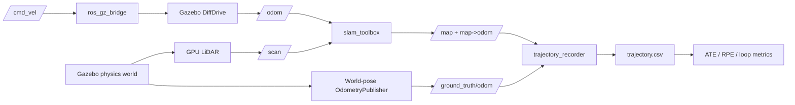

# SLAM Robot — ROS 2 + Gazebo Ground-Truth Benchmarking

[](https://github.com/VivekVRobo/slam-robot-ros2/actions/workflows/checks.yml)

A reproducibility-first ROS 2 stack for a differential-drive robot performing **2D LiDAR SLAM, pose-graph localization, Gazebo physics simulation, and quantitative trajectory benchmarking**.

> **Reference platform:** ROS 2 **Lyrical Luth (LTS)** + Gazebo **Jetty**.  
> **Status:** static contracts and the ROS 2 Lyrical package build are CI-verified; a successful Gazebo runtime, SLAM benchmark, rosbag regression, and physical-robot validation are still evidence-gated.

## Project snapshot

| | |
|---|---|
| **Problem** | Make ROS 2 SLAM experiments measurable and reproducible instead of relying only on screenshots or subjective map quality. |
| **Core stack** | ROS 2, `slam_toolbox`, Gazebo, 2D LiDAR, Python benchmarking tools |
| **Evaluation** | Ground-truth trajectory recording, ATE, RPE, loop-closure revisit error, map metrics, CPU/RSS profiling |
| **Reproducibility** | Deterministic benchmark path, machine-readable scenarios/thresholds, rosbag record/replay |
| **Current maturity** | CI-verified engineering reference; simulation-runtime and hardware claims remain explicitly evidence-gated |
| **Next proof milestone** | Successful end-to-end Gazebo run with published benchmark artifacts, followed by real LiDAR + encoder evidence |

## Why this project exists

Many SLAM demos stop at “the map looks good.” This repository is structured around a stricter question: **can the result be reproduced, measured against simulator ground truth, and clearly separated from unverified hardware claims?**

The goal is to turn a robotics demo into an engineering benchmark that another developer can inspect, run, challenge, and improve.

## What is now in this repository

- lifecycle-managed `slam_toolbox` mapping and localization;
- strict `map -> odom -> base_footprint -> base_link -> laser_link` ownership;
- Gazebo Jetty physics world with loop-rich indoor geometry;
- differential-drive physics with wheel-derived odometry;
- 360° noisy simulated LiDAR;
- a separate Gazebo world-pose odometry publisher bridged as `/ground_truth/odom`;
- explicit ROS↔Gazebo bridge configuration;
- deterministic square-loop benchmark driver;
- runtime trajectory recorder comparing ground truth against `map -> base_footprint`;
- best-fit SE(2) ATE and fixed-delta RPE metrics;
- long-horizon loop-closure revisit scoring;
- occupancy-map quality metrics;
- CPU/RSS process profiling;
- repeatable rosbag record/replay scripts;
- machine-readable benchmark thresholds and scenarios;
- evidence-based maturity gates that keep simulation and hardware claims separate.

## Simulation architecture



The Gazebo `DiffDrive` odometry is intentionally **not** used as ground truth. Ground truth comes from a separate Gazebo odometry publisher attached to the model and derived from simulator world pose.

## Run the physics simulator

```bash
ros2 launch slam_robot_ros2 simulation.launch.py headless:=false
```

Headless:

```bash
ros2 launch slam_robot_ros2 simulation.launch.py headless:=true
```

## Run SLAM + ground-truth recording

```bash
ros2 launch slam_robot_ros2 simulation_mapping.launch.py \
  headless:=true \
  record_trajectory:=true \
  run_benchmark_driver:=true
```

The benchmark driver is simulation-only by default. It publishes a deterministic loop path from `config/benchmark_path.yaml`.

For the evidence-producing workflow, use [`docs/BENCHMARK_EVIDENCE_RUNBOOK.md`](docs/BENCHMARK_EVIDENCE_RUNBOOK.md). It defines the required environment record, runtime channels, artifacts, metric generation, replay validation, and claim rules for the first published Gazebo benchmark.

## Record a regression rosbag

```bash
bash scripts/record_benchmark.sh gazebo_loop_square
```

Recorded topics include `/scan`, `/odom`, `/ground_truth/odom`, `/tf`, `/tf_static`, `/map`, `/diagnostics`, and `/clock`.

Replay:

```bash
bash scripts/replay_benchmark.sh artifacts/bags/gazebo_loop_square
```

## Quantitative trajectory evaluation

The recorder creates:

```text
stamp_s,gt_x,gt_y,gt_yaw,est_x,est_y,est_yaw
```

Evaluate it:

```bash
python tools/trajectory_metrics.py artifacts/trajectory.csv \
  --output artifacts/trajectory-metrics.json
python tools/loop_closure_metrics.py artifacts/trajectory.csv \
  --output artifacts/loop-metrics.json
```

ATE uses best-fit rigid **SE(2) alignment only**. There is no scale correction, because a metric LiDAR SLAM system should preserve scale. RPE evaluates relative motion over a fixed sample delta.

## Benchmark gate

Simulation thresholds live in `benchmarks/thresholds.yaml` and are explicitly marked as regression targets, not hardware specifications.

```bash
bash scripts/evaluate_benchmark.sh artifacts/trajectory.csv artifacts/map.pgm
```

## CPU and memory profiling

```bash
python tools/process_profile.py \
  --duration 90 \
  --match slam_toolbox \
  --match gz \
  --match ros_gz_bridge \
  --output artifacts/resource-profile.json
```

Compare resource results only on the same host / scenario / rendering mode.

## Repository map

```text
simulation/
├── worlds/slam_lab.sdf
└── models/slam_robot/{model.config,model.sdf}
config/
├── gazebo_bridge.yaml
├── benchmark_path.yaml
├── robot.yaml
├── slam_toolbox.yaml
└── slam_localization.yaml
launch/
├── simulation.launch.py
├── simulation_mapping.launch.py
├── mapping.launch.py
└── localization.launch.py
slam_robot_ros2/
├── trajectory_recorder.py
├── benchmark_driver.py
├── diagnostics.py
└── tf_monitor.py
tools/
├── trajectory_metrics.py
├── loop_closure_metrics.py
├── benchmark_gate.py
├── simulation_lint.py
├── process_profile.py
├── map_metrics.py
└── odom_metrics.py
benchmarks/
├── scenarios.yaml
└── thresholds.yaml
```

## Evidence maturity

| Gate | Current |
|---|---|
| Static engineering reference | ✅ CI-verified |
| Gazebo model/world contract | ✅ statically verified |
| ROS Lyrical build | ✅ CI-verified |
| Gazebo runtime | ❌ until launch evidence |
| Ground-truth bridge | ❌ until runtime evidence |
| SLAM simulation benchmark | ❌ |
| ATE/RPE benchmark | ❌ |
| Loop-closure benchmark | ❌ |
| Resource profile | ❌ |
| Rosbag replay regression | ❌ |
| Hardware TF/mapping | ❌ |
| Hardware localization | ❌ |

This is intentional. `config/robot.yaml` is the source of truth; simulation success is not allowed to silently become a physical-robot claim.

## Contributing

Contributions that improve reproducibility, simulation correctness, metrics, documentation, or hardware-integration evidence are welcome. Start with [`CONTRIBUTING.md`](CONTRIBUTING.md) and the open issues.

If you reproduce a benchmark on a different machine or ROS/Gazebo configuration, include the environment and artifacts so the result can be compared meaningfully.

## Physical robot next step

The hardware stage requires actual LiDAR + encoder evidence: measured wheel radius/separation, encoder resolution, LiDAR pose and timing, TF audit, real rosbags, map artifacts, repeatability runs and failure notes. See `docs/HARDWARE_EVIDENCE.md`.

## License

MIT — see `LICENSE`.
