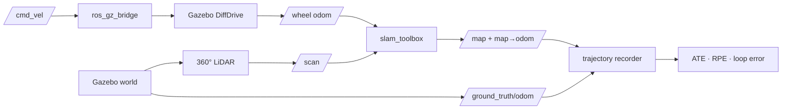

# SLAM Robot — ROS 2 + Gazebo Ground-Truth Benchmarking

[](https://github.com/VivekVRobo/slam-robot-ros2/actions/workflows/checks.yml)

A reproducibility-first ROS 2 SLAM stack for a differential-drive robot with **2D LiDAR, Gazebo ground truth, ATE/RPE trajectory evaluation, loop-closure analysis, rosbag regression, and resource profiling**.

> **Evidence boundary:** the software contracts and ROS 2 package build are CI-verified. A successful end-to-end Gazebo benchmark and physical LiDAR/encoder validation remain explicitly evidence-gated and are not claimed here yet.

## See the system in 60 seconds


```mermaid
flowchart LR
    CMD[/cmd_vel/] --> BRIDGE[ros_gz_bridge]
    BRIDGE --> DRIVE[Gazebo DiffDrive]
    DRIVE --> ODOM[/wheel odom/]
    GZ[Gazebo world] --> LIDAR[360° LiDAR]
    LIDAR --> SCAN[/scan/]
    GZ --> GT[/ground_truth/odom/]
    SCAN --> SLAM[slam_toolbox]
    ODOM --> SLAM
    SLAM --> MAP[/map + map→odom/]
    MAP --> REC[trajectory recorder]
    GT --> REC
    REC --> METRICS[ATE · RPE · loop error]
```

The important design choice is that **Gazebo wheel odometry is not treated as ground truth**. A separate world-pose publisher provides the reference trajectory used for evaluation.

### What you can inspect immediately

| Surface | What it proves or enables |
| --- | --- |
| [`simulation/`](simulation/) | Gazebo world, robot model and physics-facing configuration |
| [`tools/trajectory_metrics.py`](tools/trajectory_metrics.py) | Best-fit SE(2) ATE + fixed-delta RPE evaluation |
| [`tools/loop_closure_metrics.py`](tools/loop_closure_metrics.py) | Revisit / long-horizon loop-closure scoring |
| [`scripts/record_benchmark.sh`](scripts/record_benchmark.sh) | Repeatable benchmark rosbag capture |
| [`scripts/replay_benchmark.sh`](scripts/replay_benchmark.sh) | Regression replay path |
| [`docs/BENCHMARK_EVIDENCE_RUNBOOK.md`](docs/BENCHMARK_EVIDENCE_RUNBOOK.md) | Exact evidence-producing benchmark procedure |
| [`docs/RELEASE_READINESS.md`](docs/RELEASE_READINESS.md) | First tagged-release gate and allowed claims |

## Why this project exists

Many SLAM demos stop at “the map looks good.” This repository asks a stricter question:

> **Can the result be reproduced, measured against simulator ground truth, replayed, and clearly separated from unverified hardware claims?**

The project is built around measurable robotics evidence rather than screenshot-only success.

## Project snapshot

| Area | Current state |
| --- | --- |
| Core stack | ROS 2, `slam_toolbox`, Gazebo, 2D LiDAR, Python |
| Mapping/localization | Lifecycle-managed SLAM Toolbox |
| Ground truth | Separate Gazebo world-pose odometry |
| Trajectory metrics | ATE + RPE with metric-scale SE(2) alignment |
| Loop evaluation | Long-horizon revisit error |
| Regression | rosbag record/replay tooling |
| Runtime profiling | CPU + RSS process profiling |
| CI state | Static contracts + ROS package build verified |
| Simulation benchmark | Evidence gate still pending |
| Physical robot validation | Not yet claimed |

## What is implemented

- lifecycle-managed `slam_toolbox` mapping and localization;
- strict `map -> odom -> base_footprint -> base_link -> laser_link` ownership;
- Gazebo physics world with loop-rich indoor geometry;
- differential-drive physics with wheel-derived odometry;
- 360° noisy simulated LiDAR;
- a separate Gazebo world-pose publisher exposed as `/ground_truth/odom`;
- explicit ROS ↔ Gazebo bridge configuration;
- deterministic square-loop benchmark driver;
- trajectory recording against simulator ground truth;
- best-fit SE(2) ATE and fixed-delta RPE metrics;
- loop-closure revisit scoring;
- occupancy-map quality checks;
- CPU/RSS process profiling;
- repeatable rosbag record/replay scripts;
- machine-readable benchmark thresholds and scenarios;
- evidence gates that keep simulation and hardware claims separate.

## Quick start

### Reference platform

- ROS 2 **Lyrical Luth (LTS)**
- Gazebo **Jetty**

Run the simulator:

```bash
ros2 launch slam_robot_ros2 simulation.launch.py headless:=false
```

Run headless:

```bash
ros2 launch slam_robot_ros2 simulation.launch.py headless:=true
```

Run SLAM with trajectory recording and the deterministic benchmark driver:

```bash
ros2 launch slam_robot_ros2 simulation_mapping.launch.py \
  headless:=true \
  record_trajectory:=true \
  run_benchmark_driver:=true
```

For the evidence-producing procedure, follow [`docs/BENCHMARK_EVIDENCE_RUNBOOK.md`](docs/BENCHMARK_EVIDENCE_RUNBOOK.md).

## Quantitative evaluation

The trajectory recorder produces:

```text
stamp_s,gt_x,gt_y,gt_yaw,est_x,est_y,est_yaw
```

Evaluate trajectory quality:

```bash
python tools/trajectory_metrics.py artifacts/trajectory.csv \
  --output artifacts/trajectory-metrics.json

python tools/loop_closure_metrics.py artifacts/trajectory.csv \
  --output artifacts/loop-metrics.json
```

ATE uses rigid **SE(2) alignment only**. No scale correction is applied because a metric LiDAR SLAM system should preserve scale.

## Rosbag regression

Record:

```bash
bash scripts/record_benchmark.sh gazebo_loop_square
```

The benchmark capture includes `/scan`, `/odom`, `/ground_truth/odom`, `/tf`, `/tf_static`, `/map`, `/diagnostics`, and `/clock`.

Replay:

```bash
bash scripts/replay_benchmark.sh artifacts/bags/gazebo_loop_square
```

## Resource profiling

```bash
python tools/process_profile.py \
  --duration 90 \
  --match slam_toolbox \
  --match gz \
  --match ros_gz_bridge \
  --output artifacts/resource-profile.json
```

Only compare resource results under the same host, scenario and rendering mode.

## Evidence maturity

| Claim | Status |
| --- | --- |
| ROS package structure/build | Verified in CI |
| Static TF/config/contracts | Verified in CI |
| Deterministic benchmark tooling | Implemented |
| Gazebo runtime benchmark | Pending evidence gate |
| Published ATE/RPE result | Pending evidence gate |
| rosbag regression proof | Pending evidence gate |
| Real LiDAR + encoder validation | Not yet claimed |

A green software build is **not** treated as proof of a successful Gazebo benchmark or physical robot performance.

## Release status

The repository already contains a first-release gate in [`docs/RELEASE_READINESS.md`](docs/RELEASE_READINESS.md) and a copy-ready draft in [`docs/RELEASE_NOTES_DRAFT.md`](docs/RELEASE_NOTES_DRAFT.md).

The intended first tag is a conservative **v0.1.0 software-reference release**. It should be published only after the exact release commit satisfies the documented gate. Runtime benchmark numbers must remain excluded until the evidence bundle exists.

## Documentation

- [`docs/ARCHITECTURE.md`](docs/ARCHITECTURE.md)
- [`docs/GAZEBO_SIMULATION.md`](docs/GAZEBO_SIMULATION.md)
- [`docs/MAPPING_WORKFLOW.md`](docs/MAPPING_WORKFLOW.md)
- [`docs/LOCALIZATION_WORKFLOW.md`](docs/LOCALIZATION_WORKFLOW.md)
- [`docs/LOOP_CLOSURE_BENCHMARK.md`](docs/LOOP_CLOSURE_BENCHMARK.md)
- [`docs/PERFORMANCE_BENCHMARK.md`](docs/PERFORMANCE_BENCHMARK.md)
- [`docs/HARDWARE_EVIDENCE.md`](docs/HARDWARE_EVIDENCE.md)
- [`docs/HARDWARE_BRINGUP.md`](docs/HARDWARE_BRINGUP.md)
- [`docs/LIDAR_EXTRINSIC_CALIBRATION.md`](docs/LIDAR_EXTRINSIC_CALIBRATION.md)

## Contributing

Useful contributions include:

- Gazebo benchmark reproducibility;
- SLAM Toolbox tuning with evidence;
- trajectory/loop metric improvements;
- rosbag regression coverage;
- diagnostics and failure-mode tooling;
- hardware bring-up documentation;
- real LiDAR/encoder evidence once available.

If this project is useful to your robotics work, **star the repository or follow `VivekVRobo`** to track the benchmark and hardware-validation milestones.

## License

MIT. See [`LICENSE`](LICENSE).
