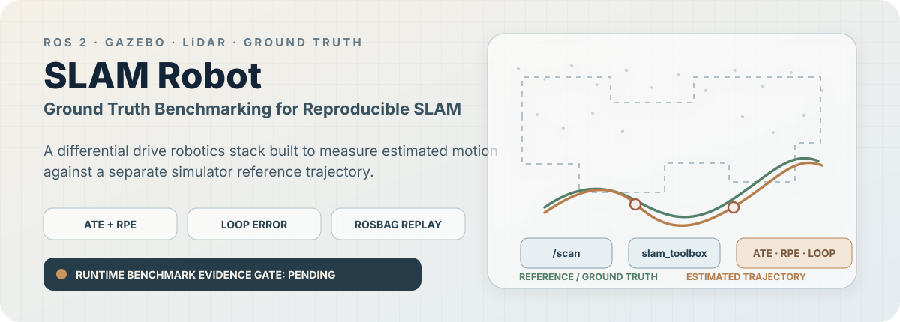
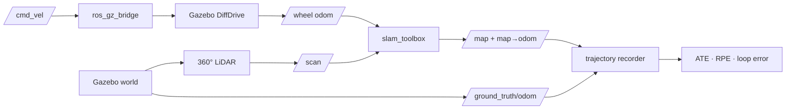

<p align="center">
  
</p>

<p align="center">
  <a href="https://github.com/VivekVRobo/slam-robot-ros2/actions/workflows/checks.yml"></a>
  
  
  
  
</p>

<p align="center">
  <strong>A reproducibility first ROS 2 SLAM stack for a differential drive robot with Gazebo ground truth, ATE and RPE trajectory evaluation, loop closure analysis, rosbag regression, and resource profiling.</strong>
</p>

> [!IMPORTANT]
> **Evidence boundary:** software contracts and the ROS 2 package build are CI verified. A successful end to end Gazebo benchmark, published ATE and RPE values, rosbag regression proof, and physical LiDAR plus encoder validation remain explicitly evidence gated and are not claimed until the required artifacts exist.

<p align="center">
  <a href="./docs/ARCHITECTURE.md"><strong>Architecture</strong></a> ·
  <a href="./docs/BENCHMARK_EVIDENCE_RUNBOOK.md"><strong>Benchmark Runbook</strong></a> ·
  <a href="./docs/TRAJECTORY_EVALUATION.md"><strong>Trajectory Metrics</strong></a> ·
  <a href="./docs/RELEASE_READINESS.md"><strong>Release Gate</strong></a>
</p>

---

## Current Evidence State

| Surface | Evidence | Status |
| --- | --- | :---: |
| **ROS package and static contracts** | CI build and configuration checks | ✅ Verified |
| **Deterministic benchmark tooling** | Driver, capture, evaluation, thresholds, scenarios | ✅ Implemented |
| **Gazebo ground truth path** | Separate world pose reference topic | ✅ Implemented |
| **ATE and RPE tooling** | Metric scale SE(2) trajectory evaluation | ✅ Implemented |
| **Loop closure evaluation** | Revisit and long horizon error tooling | ✅ Implemented |
| **Rosbag regression workflow** | Record and replay scripts | ✅ Implemented |
| **Gazebo runtime benchmark** | Complete evidence bundle | ◐ Pending |
| **Published ATE and RPE result** | Measured benchmark output | ◐ Pending |
| **Physical LiDAR and encoder validation** | Hardware evidence | ◐ Not claimed |

A green build is not treated as proof of a successful simulation benchmark or physical robot performance.

---

## See the System in 60 Seconds


```mermaid
flowchart LR
    CMD[/cmd_vel/] --> BRIDGE[ros_gz_bridge]
    BRIDGE --> DRIVE[Gazebo DiffDrive]
    DRIVE --> ODOM[/wheel odom/]

    GZ[Gazebo world] --> LIDAR[360° LiDAR]
    LIDAR --> SCAN[/scan/]
    GZ --> GT[/ground_truth/odom/]

    SCAN --> SLAM[slam_toolbox]
    ODOM --> SLAM
    SLAM --> MAP[/map + map→odom/]

    MAP --> REC[trajectory recorder]
    GT --> REC
    REC --> METRICS[ATE · RPE · loop error]
```

The key design choice is that **Gazebo wheel odometry is not treated as ground truth**. A separate world pose publisher provides the reference trajectory used for evaluation.

### Inspect the proof surfaces

| Surface | What it proves or enables |
| --- | --- |
| [`simulation/`](simulation/) | Gazebo world, robot model, and physics facing configuration |
| [`tools/trajectory_metrics.py`](tools/trajectory_metrics.py) | Best fit SE(2) ATE and fixed delta RPE evaluation |
| [`tools/loop_closure_metrics.py`](tools/loop_closure_metrics.py) | Revisit and long horizon loop closure scoring |
| [`scripts/record_benchmark.sh`](scripts/record_benchmark.sh) | Repeatable benchmark rosbag capture |
| [`scripts/replay_benchmark.sh`](scripts/replay_benchmark.sh) | Regression replay path |
| [`docs/BENCHMARK_EVIDENCE_RUNBOOK.md`](docs/BENCHMARK_EVIDENCE_RUNBOOK.md) | Exact evidence producing benchmark procedure |
| [`docs/RELEASE_READINESS.md`](docs/RELEASE_READINESS.md) | First tagged release gate and allowed claims |

---

## Why This Project Exists

Many SLAM demos stop at:

> **The map looks good.**

This repository asks a stricter question:

> **Can the result be reproduced, measured against simulator ground truth, replayed, and clearly separated from unverified hardware claims?**

The project is built around measurable robotics evidence rather than screenshot only success.

---

## What Is Implemented

### Simulation and robot model

* Gazebo physics world with loop rich indoor geometry
* differential drive physics with wheel derived odometry
* 360 degree noisy simulated LiDAR
* separate Gazebo world pose publisher exposed as `/ground_truth/odom`
* explicit ROS to Gazebo bridge configuration

### SLAM and frame ownership

* lifecycle managed `slam_toolbox` mapping and localization
* explicit `map -> odom -> base_footprint -> base_link -> laser_link` ownership
* trajectory recording against simulator ground truth
* occupancy map quality checks

### Benchmarking and evaluation

* deterministic square loop benchmark driver
* best fit metric scale SE(2) ATE
* fixed delta RPE
* loop closure revisit scoring
* machine readable benchmark thresholds and scenarios
* CPU and RSS process profiling
* repeatable rosbag record and replay workflow

### Evidence discipline

* simulation and hardware claims are kept separate
* benchmark artifacts are generated through documented runbooks
* incomplete runtime evidence is marked as pending instead of inferred from CI success

---

## Quick Start

### Reference platform

* ROS 2 **Lyrical Luth**
* Gazebo **Jetty**

Run the simulator:

```bash
ros2 launch slam_robot_ros2 simulation.launch.py headless:=false
```

Run headless:

```bash
ros2 launch slam_robot_ros2 simulation.launch.py headless:=true
```

Run SLAM with trajectory recording and the deterministic benchmark driver:

```bash
ros2 launch slam_robot_ros2 simulation_mapping.launch.py \
  headless:=true \
  record_trajectory:=true \
  run_benchmark_driver:=true
```

For the evidence producing procedure, follow [`docs/BENCHMARK_EVIDENCE_RUNBOOK.md`](docs/BENCHMARK_EVIDENCE_RUNBOOK.md).

---

## Quantitative Evaluation

The trajectory recorder produces:

```text
stamp_s,gt_x,gt_y,gt_yaw,est_x,est_y,est_yaw
```

Evaluate trajectory quality:

```bash
python tools/trajectory_metrics.py artifacts/trajectory.csv \
  --output artifacts/trajectory-metrics.json

python tools/loop_closure_metrics.py artifacts/trajectory.csv \
  --output artifacts/loop-metrics.json
```

ATE uses rigid **SE(2) alignment only**. No scale correction is applied because a metric LiDAR SLAM system should preserve scale.

---

## Rosbag Regression

Record a benchmark bag:

```bash
bash scripts/record_benchmark.sh gazebo_loop_square
```

The capture includes:

`/scan` · `/odom` · `/ground_truth/odom` · `/tf` · `/tf_static` · `/map` · `/diagnostics` · `/clock`

Replay it:

```bash
bash scripts/replay_benchmark.sh artifacts/bags/gazebo_loop_square
```

The goal is to preserve a repeatable input path for regression and tuning rather than relying on one live simulation session.

---

## Resource Profiling

```bash
python tools/process_profile.py \
  --duration 90 \
  --match slam_toolbox \
  --match gz \
  --match ros_gz_bridge \
  --output artifacts/resource-profile.json
```

Only compare resource results under the same host, scenario, rendering mode, and software configuration.

---

## Evidence Production

The repository already contains an evidence campaign path rather than expecting results to be assembled manually.

Relevant entry points:

* [`scripts/run_gazebo_benchmark.sh`](scripts/run_gazebo_benchmark.sh)
* [`scripts/run_simulation_evidence_campaign.sh`](scripts/run_simulation_evidence_campaign.sh)
* [`scripts/evaluate_benchmark.sh`](scripts/evaluate_benchmark.sh)
* [`evidence/README.md`](evidence/README.md)
* [`docs/BENCHMARK_EVIDENCE_RUNBOOK.md`](docs/BENCHMARK_EVIDENCE_RUNBOOK.md)
* [`benchmarks/scenarios.yaml`](benchmarks/scenarios.yaml)
* [`benchmarks/thresholds.yaml`](benchmarks/thresholds.yaml)

A benchmark result should preserve the exact commit, environment, configuration, scenario, raw trajectory, metric outputs, and relevant failure information.

---

## Hardware Validation Boundary

Physical LiDAR and encoder performance is not inferred from simulation.

The repository already separates hardware bringup and hardware evidence work through:

* [`docs/HARDWARE_BRINGUP.md`](docs/HARDWARE_BRINGUP.md)
* [`docs/HARDWARE_EVIDENCE.md`](docs/HARDWARE_EVIDENCE.md)
* [`docs/LIDAR_EXTRINSIC_CALIBRATION.md`](docs/LIDAR_EXTRINSIC_CALIBRATION.md)
* [`docs/WHEEL_ODOMETRY_CALIBRATION.md`](docs/WHEEL_ODOMETRY_CALIBRATION.md)
* [`scripts/hardware_preflight.sh`](scripts/hardware_preflight.sh)
* [`scripts/record_hardware_evidence.sh`](scripts/record_hardware_evidence.sh)

Hardware claims should appear only after those evidence gates are actually satisfied.

---

## Documentation

### Architecture and contracts

* [Architecture](docs/ARCHITECTURE.md)
* [Requirements](docs/REQUIREMENTS.md)
* [TF Contract](docs/TF_CONTRACT.md)
* [TF Tree](docs/TF_TREE.md)
* [Sensor and Odometry Contract](docs/SENSOR_ODOMETRY_CONTRACT.md)

### Simulation and evaluation

* [Gazebo Simulation](docs/GAZEBO_SIMULATION.md)
* [Mapping Workflow](docs/MAPPING_WORKFLOW.md)
* [Localization Workflow](docs/LOCALIZATION_WORKFLOW.md)
* [Trajectory Evaluation](docs/TRAJECTORY_EVALUATION.md)
* [Loop Closure Benchmark](docs/LOOP_CLOSURE_BENCHMARK.md)
* [Performance Benchmark](docs/PERFORMANCE_BENCHMARK.md)
* [Rosbag Benchmark](docs/ROSBAG_BENCHMARK.md)
* [Resource Profiling](docs/RESOURCE_PROFILING.md)

### Evidence and validation

* [Benchmark Evidence Runbook](docs/BENCHMARK_EVIDENCE_RUNBOOK.md)
* [Validation Plan](docs/VALIDATION_PLAN.md)
* [Failure Modes](docs/FAILURE_MODES.md)
* [WSL2 Gazebo Evidence](docs/WSL2_GAZEBO_EVIDENCE.md)
* [Hardware Evidence](docs/HARDWARE_EVIDENCE.md)

---

## Release Status

The repository contains a first release gate in [`docs/RELEASE_READINESS.md`](docs/RELEASE_READINESS.md) and a copy ready draft in [`docs/RELEASE_NOTES_DRAFT.md`](docs/RELEASE_NOTES_DRAFT.md).

The intended first tag is a conservative **v0.1.0 software reference release**. It should be published only after the exact release commit satisfies the documented gate.

Runtime benchmark numbers remain excluded until the benchmark evidence bundle exists.

---

## Contributing

Useful contributions include:

* Gazebo benchmark reproducibility
* SLAM Toolbox tuning with evidence
* trajectory and loop metric improvements
* rosbag regression coverage
* diagnostics and failure mode tooling
* hardware bringup documentation
* real LiDAR and encoder evidence once available

If this project is useful to your robotics work, **star the repository or follow [VivekVRobo](https://github.com/VivekVRobo)** to track the benchmark and hardware validation milestones.

---

## License

MIT. See [`LICENSE`](LICENSE).
